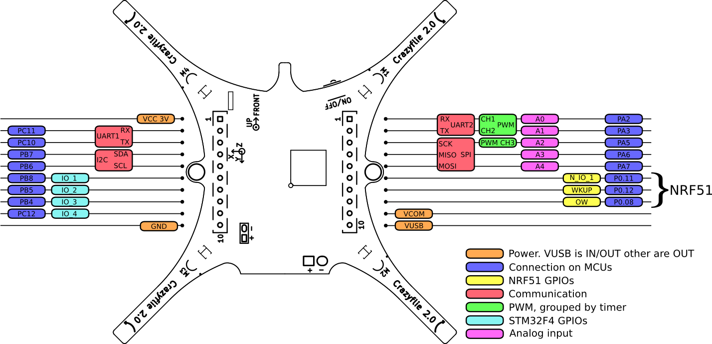

## Crazyflie 2.0 expansion board template

This repo contains a Crazyflie 2.0 expansion board template in the form
of a KiCad project. The template already contains the schematics, component mapping
and layout with the expansion connector. To make it easier to use the template
it also contains the Crazyflie 2.0 boardoutline and key components on the Eco1.User layer.

Here's an overview of the pinout of the expansion header:

Users that want to design their own decks (expansion boards) for the Crazyflie 2.0 can use the deck template to get started. It contains the initial schematic with the expansion connector, the component mapping and the layout including the connector. In order for users to easier be able to see how their expansion board will fit we have added the Crazyflie 2.0 outline as well as some key components. The added drawings are on the Eco1.User layer.

The project is made using KiCad and is licensed under CC-BY 4.0.

